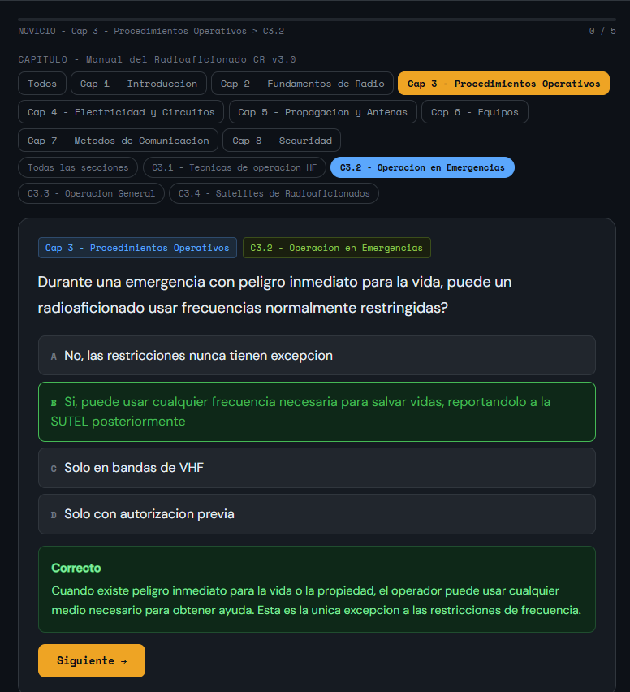

# 📻 Simulador de Examen de Radioaficionado - Costa Rica

  

  Herramienta de práctica gratuita para obtener tu licencia de radioaficionado en Costa Rica. 
  Basada en el temario oficial de la <strong>SUTEL</strong> y el <em>Manual del Radioaficionado de Costa Rica v3.0</em>.

---

## ✨ Características Principales

- **100% Responsive**: Funciona perfectamente en celular y computadora. No requiere instalación ni crear cuentas.
- **Banco Realista**: 285 preguntas distribuidas en los 8 capítulos del manual oficial.
- **Aleatoriedad**: Selección aleatoria de preguntas en cada sesión, replicando el comportamiento real del examen de la SUTEL.
- **Soporte Multimedia**: Preguntas con imágenes de circuitos, componentes, diagramas y patrones de radiación.
- **Retroalimentación Inmediata**: Explicación detallada de cada respuesta al momento de seleccionar.
- **Referencia al Manual**: Cada pregunta indica la página exacta del Manual CR v3.0 donde se encuentra el tema.
- **Filtros Inteligentes**: Practica por categoría (Novicio, Intermedio, Superior) o por capítulo/sección específica.
- **Indicador de Puntaje**: Referencia visual al 70% mínimo requerido para aprobar.

---

## 📚 Contenido por Capítulo

| Cap. | Título del Capítulo | Preguntas |
| :---: | :--- | :---: |
| **1** | Introducción a la radioafición | 33 |
| **2** | Fundamentos de Radio y Señales | 25 |
| **3** | Procedimientos y prácticas operativas | 36 |
| **4** | Electricidad, componentes y circuitos | 60 |
| **5** | Propagación, antenas y alimentadores | 40 |
| **6** | Equipos para radioaficionados | 32 |
| **7** | Métodos de comunicación entre radioaficionados | 27 |
| **8** | Seguridad de la estación | 32 |
| | **Total** | **285** |

> [!IMPORTANT]
> **Nota sobre el examen real:** La SUTEL define las preguntas del examen teórico de manera aleatoria y automática mediante su plataforma web. Si realizas la prueba varias veces para la misma categoría, serás evaluado con preguntas diferentes. Este simulador replica exactamente ese comportamiento.

---

## 📸 Vista Previa

---

## 📖 Fuentes Oficiales

Este proyecto se basa estrictamente en la normativa vigente:

- 📘 Manual del Radioaficionado de Costa Rica v3.0 (agosto 2025)
- ⚖️ Reglamento del Servicio de Radioaficionados - Decreto Ejecutivo N° 40639-MICITT
- 📡 Plan Nacional de Atribución de Frecuencias (PNAF) - SUTEL
- 📋 Resolución RCS-264-2025 — Procedimiento y mecanismos para la realización del examen teórico
- 🌐 [Información oficial SUTEL](https://www.sutel.go.cr/pagina/radio-aficionados-y-banda-ciudadana)

---

## 🤝 Créditos y Agradecimientos

Desarrollado por **[TI3WTI](https://www.qrz.com/db/TI3WTI)** como herramienta de apoyo para la comunidad de radioaficionados de Costa Rica.

El código fuente es abierto y está disponible en [github.com/ti3wti/examen-tango-india](https://github.com/ti3wti/examen-tango-india). Cualquier persona puede revisarlo, mejorarlo o adaptarlo para su propio país o contexto, siguiendo el mismo espíritu de conocimiento compartido que caracteriza a la radioafición.

Agradecimientos especiales a:

- 🎓 **RadioLab - TEC**: Escuela de Ingeniería Electrónica, Instituto Tecnológico de Costa Rica (ITCR)
- 📻 **TI0ARC**: Asociación de Radioaficionados de Cartago

  

---

  ¿Encontraste un error o tienes una sugerencia? <a href="https://github.com/ti3wti/examen-tango-india/issues">Abre un issue</a> o contribuye al proyecto.

